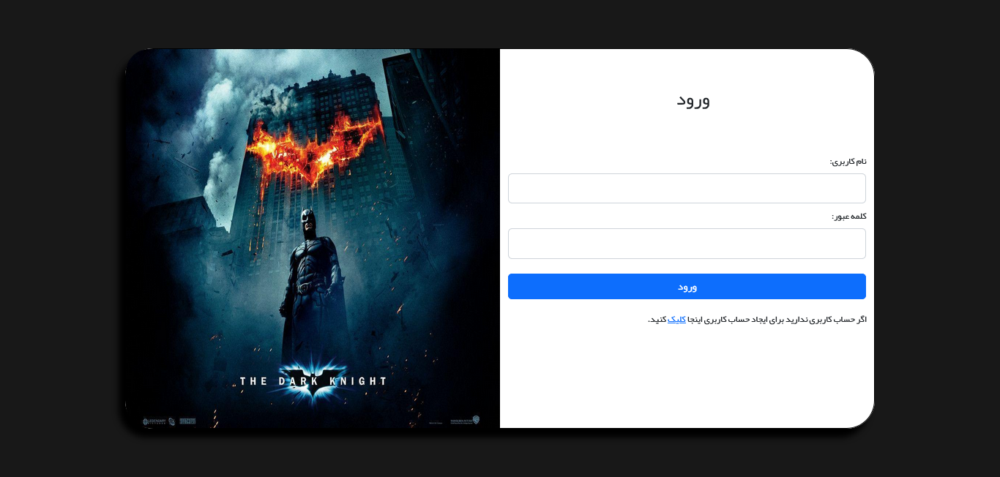
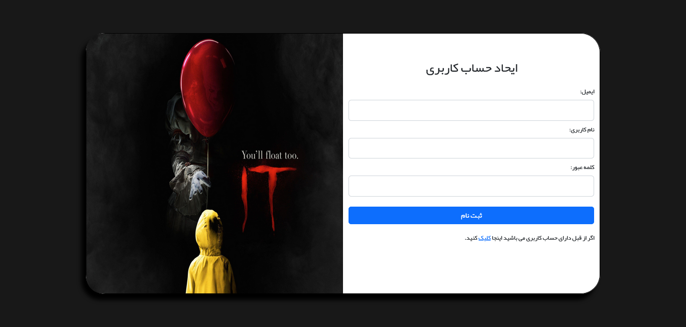
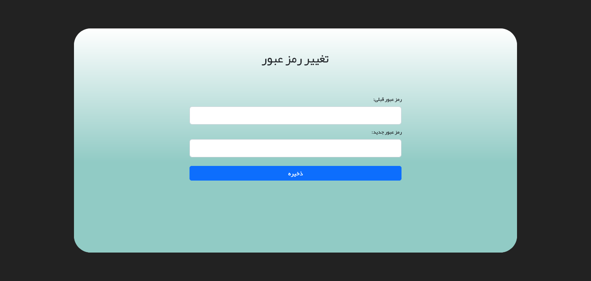
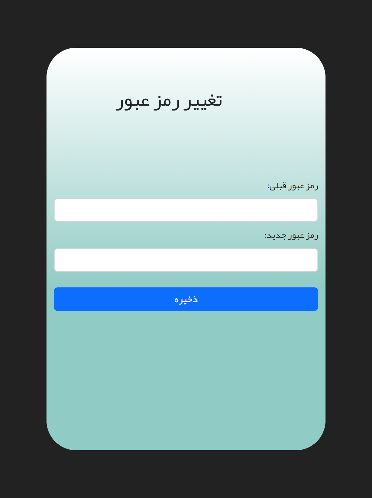
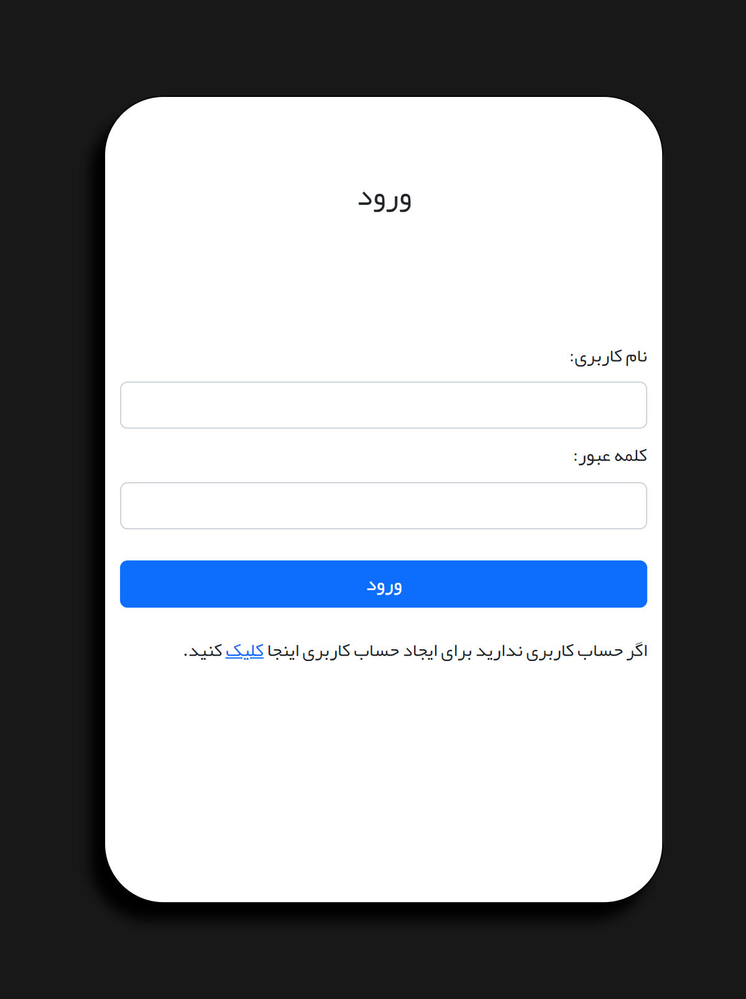

# Movie-loginPge
# Movie-loginPge

This project have sign-up page login and change password and these pages use NodeJs and mongodb to store a data.

## Overview

### The challenge

Users should be able to:

- View the optimal layout for the interface depending on their device's screen size
- After sign-up can go to login page and log in their acount.

### Screenshot

<h1>Login page view:</h1>

<h1>sign up page view:</h1>

<h1>change password page view:</h1>

<h1>Mobile View</h1>

<h1>Mobile View</h1>

## My process

### Built with

- Semantic HTML5 markup
- CSS custom properties
- Flexbox
- CSS Grid
- Mobile-first workflow
- JavaScript
- [Node](https://nodejs.org/) - JS backend

### Continued development

In next project I decide to learn ReactJs and do defined some project to do and also decide to make another login page with higher security level.

### Useful resources

- [YouTube](https://www.youtube.com) - In youtube you can find plenty courses to learn What is NodeJs
how it's work, and after learning NodeJs you can defined a project and search it in youtube google and other sources to make your project and solve your problem.

- [Google](https://www.google.com)

## Author

- Mohammad reza Dargi
